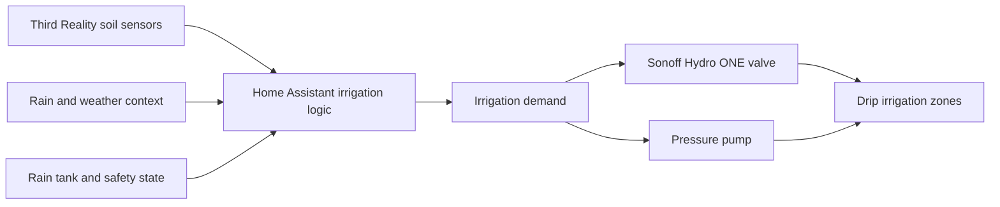

# Smart Irrigation with Home Assistant

**Video:** https://youtu.be/jT2qFfi1r0c

This project shows the irrigation layer of my Home Assistant water-management
system: soil-moisture sensors provide context, Home Assistant decides whether
watering is needed and safe, and a Zigbee valve controls water delivery.

It is a follow-up to [Rain Tank Water Management](../rain-tank-water-management/),
which covers the rainwater source, pump protection, freeze lockouts, and shared
safety constraints.

## System Architecture

The important design distinction is between **demand** and **permission**:

- Soil moisture can request watering.
- Tank level, freeze protection, rain context, and system health decide whether watering is allowed.
- The valve and pump only run when demand and safety conditions agree.
- Shutdown logic turns demand off before stopping the pump and closing the valve.

## Devices

- [Third Reality Smart Soil Moisture Sensor Gen2](https://www.thirdreality.com/products/smart-soil-moisture-sensor-gen2?ref=BeardedTinker) (*)
- [SONOFF Hydro ONE single-channel Zigbee smart water valve](https://sonoff.tech/en-eu/products/sonoff-hydro-series-hydro-one-zigbee-smart-water-valve-swv-zfu-swv-zfe?ref=601&utm_source=affiliate) (*) — production valve used by the final system
- [SONOFF Hydro DUO dual-channel Zigbee smart water valve](https://sonoff.tech/en-eu/products/sonoff-hydro-duo-dual-channel-zigbee-smart-water-valve-swv-zf2e-swv-zf2u?ref=601&utm_source=affiliate) (*) — tested during the earlier two-zone prototype phase

Links marked with (*) are affiliate links. I may earn a small commission if you buy through them, at no extra cost to you.

## Files

- [Smart Irrigation package](./home-assistant/packages/smart_irrigation.yaml)
- [Dashboard snippets](./dashboard_snippets.yaml)

## Install

1. Copy `home-assistant/packages/smart_irrigation.yaml` into your Home Assistant `packages/` directory.
2. Replace the example valve, safety-sensor, and soil-moisture entity IDs listed below.
3. Confirm that the Rain Tank project entities used by the package exist.
4. Validate the Home Assistant configuration and restart Home Assistant to load the package.
5. Commission and test the valve locally before enabling `input_boolean.smart_irrigation_commissioned`.

The package deliberately does not include an automatic watering schedule. It
calculates whether irrigation is allowed and provides bounded Run and Stop
scripts, but leaves automatic demand scheduling as an explicit user decision.

## Entity Mapping

Entities provided by the [Rain Tank Water Management](../rain-tank-water-management/) project:

- `binary_sensor.rain_tank_pump_allowed`
- `sensor.rain_tank_fill_percentage`
- `switch.water_pump`

Replace these example entities with the IDs created by your Hydro ONE valve and
Third Reality sensors:

- `switch.irrigation_valve`
- `binary_sensor.irrigation_valve_water_leak`
- `binary_sensor.irrigation_valve_water_depletion`
- `sensor.irrigation_soil_moisture_1`
- `sensor.irrigation_soil_moisture_2`
- `sensor.irrigation_soil_moisture_3`
- `sensor.irrigation_soil_moisture_4`

## Related Project

For a smaller battery-powered watering setup for individual plants, see the
[Third Reality Smart Watering Kit](../third-reality-smart-watering-kit/).

## Notes

- This is an architecture overview, not a plug-and-play configuration.
- Adapt entity IDs, moisture thresholds, runtime limits, and safety conditions to your own installation.
- Smart-home automation is an additional control layer; use suitable plumbing, pressure regulation, and local hardware safeguards.
